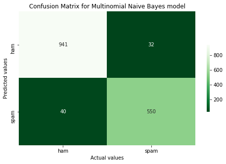

# SMS CLASSIFIER TO SPAM & HAM 

Short Message Service or SMS considered to be the text messaging service component of Telephone or Internet. In our day-to-day life we do receive considerable amount of SMS either from Friends, Telecom or Bank companies regarding our daily transactions or from tons of other sources. Some of these SMS texts are genuine whereas some can lead to fraudulent incidents.

Main task of this case study is making a Machine Learning model which can predict the SMS as HAM or SPAM with the help of text body of SMS. Dataset for this case study can be found at Kaggle. It consist of 5574 English text messages which are labeled as Ham or Spam

